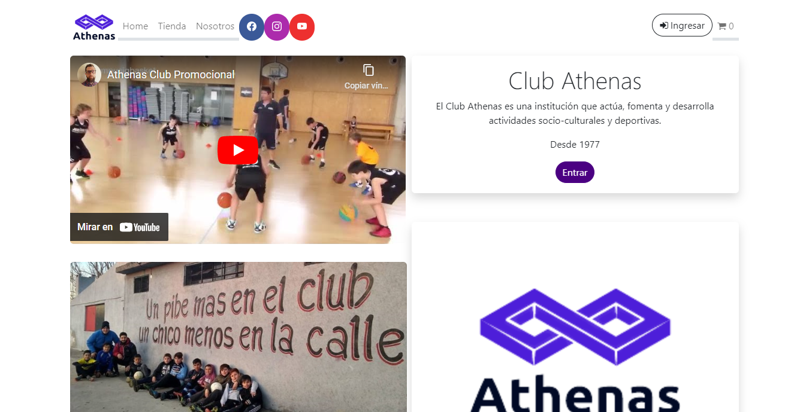
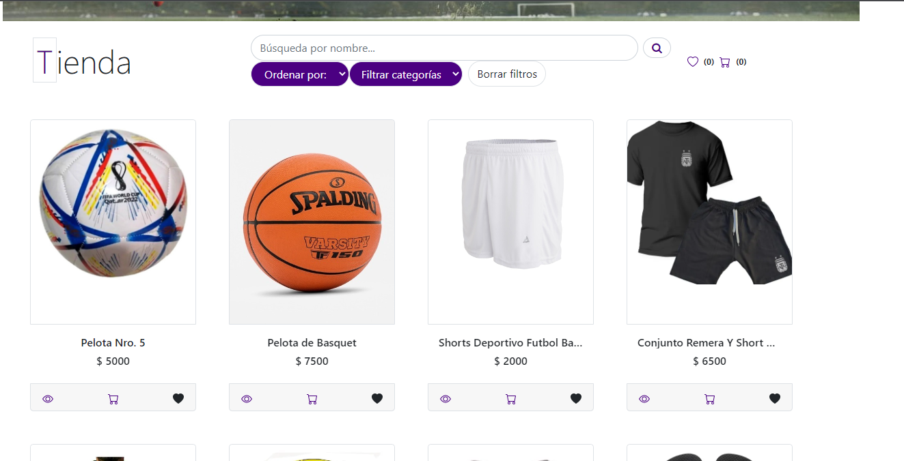

<h1>Web Full Stack Developer Jr</h1>

## Hola! Mi nombre es Brenda Alaniz :smile: 
- 💻 Actualmente estoy trabajando en mi portafolio y terminando otros proyectos.
- Mi objetivo principal es desarrollarme profesionalmente y cumplir con mis objetivos, de modo que busco oportunidades que me permitan hacerlo. 
- 📚 Aprendiendo Python.
- ⚡ Dato curioso: entreno Jiu Jitsu y me gusta mucho leer novelas.

---

<h2> Skills  </h2>

              

<h2> 📌 Mis proyectos </h2>

### Athenas Club App
App administrativa para un club deportivo.

<a href="https://github.com/MATarg81/proyecto-final">
      
      Link a repo
</a>
 
<a href="https://proyecto-final-one-murex.vercel.app/">
      
      Link deploy
</a>

### Henry Food
App de recetas que incluye: búsquedas por nombre e ID, filtrados, ordenamientos y creación de nuevas recetas. Llamada a API REST y base de datos propia, homogeneización de datos y presentación.

<!-- 
 -->

<a href="https://github.com/Macrofago096/Proyecto-Individual-Food">
      
      Link a repo
</a>
 

## 📫 Contacto

    <a href="https://alanizbrenda26@gmail.com">
      
     alanizbrenda26@gmail.com
    </a>    
     
    <a href="https://www.linkedin.com/in/brenda-c-alaniz-/">
      
     
    <a>
    📞+549 1131250992
    </a>

  
<footer align='center'>Thanks for visiting!</footer>
